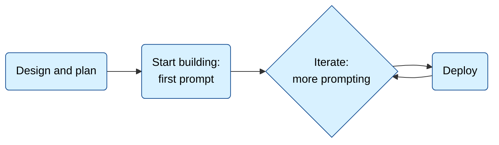

> ## Documentation Index
> Fetch the complete documentation index at: https://support.bolt.new/llms.txt
> Use this file to discover all available pages before exploring further.

# Project lifecycle

> The lifecycle of a project, and how to work through it with Bolt.

This guide is for people who are new to Bolt and software development. It's designed to help you plan your project, create a good first <Tooltip tip="A prompt is a message you send to the AI">prompt</Tooltip>, and understand the steps involved in building a project.

## The lifecycle of a project

## Step 1: Design and plan

Before you start building, you need to know what you're building and why.

Bolt provides multiple ways to add your designs:

* Describe them in the prompt.
* [Attach files](/building/upload-files) to the conversation.
* [Import from Figma](/integrations/figma).

Although you can start with an open-ended prompt, such as `Hey Bolt, please build a todo list app`, you'll have more success if you design and plan first. Try to come up with answers to the following questions.

**What do you want to build?**

In general terms, what are you creating? For example: a todo list application, or a portfolio website, or a mobile habit tracker app.

**Who is it for?**

Your user should be at the center of your design choices. Think about what they need and how they'll use your application.

**What features does it have?**

List out the features: the things users can do. For example, if building a to-do list app, your feature list might include:

> * Create new todos
> * Edit existing todos
> * Delete todos
> * Schedule the time and date for a todo

**What look and feel do you want?**

Give Bolt guidance on the aesthetic you want for your application. You can describe it, or [attach images](/building/upload-files) for inspiration.

**How will users access it?**

It’s important to make this decision at the start, so that Bolt can structure your application to work with the platforms you want to publish to.

Think about the format:

* Website: the user accesses this in their browser. It's mostly content and information. For example: blogs, news sites, portfolios, galleries, and so on.
* Web application: the user accesses this in their browser. It's interactive, allowing users to add their own data. It's a tool, not just a content site. For example: Bolt is a web application!
* Mobile application: the user installs an app on their phone or tablet.

Then you'll prompt Bolt to build for the format you want:

* If users will access your application in their browser, the easiest way is to publish and host using [Bolt's built-in hosting](/cloud/hosting).
* If you want to build a mobile app, Bolt integrates with [Expo](/integrations/expo), which allows you to build your application once, then package it up for multiple platforms.

**An example answer**

> I want to build a todo list app. It's for people who love timeblocking and the pomodoro productivity method. Its features should include: adding and scheduling todos, and a pomodoro timer. It should have a modern, clean, but colorful aesthetic. Users should be able to add, edit, and delete todos. Users should be able to schedule the time and date for their todos. Users should be able to view both their unscheduled task list, and a daily schedule with any scheduled tasks. Users will access the application in their browser, so make sure it's suitable for hosting on Netlify.

## Step 2: Your first prompt

Writing good prompts is key to success with AI tools.

<Tip>
  For detailed guidance, there's a full best practices article on how to [prompt effectively](/best-practices/prompting-effectively). It's recommended to read this in full. You may also want to check out [Intro to LLMs](/concepts/intro-llms) for a quick introduction to AI terminology and concepts.
</Tip>

If you built up answers to the questions above, you can use those as the basis for your first prompt. Before you start, use Bolt to improve your prompt:

<Frame>
  <video className="block mx-auto" src="https://res.cloudinary.com/dlq2nawz5/video/upload/f_auto,q_auto/v1776453551/enhance-prompt-guided-questions_t74hvs.mp4" alt="The chatbox with the Enhance prompt option open and guided questions displayed." controls={true} autoPlay={true} muted={true} loop={true} />
</Frame>

1. In the chatbox, type your prompt.
2. In the bottom-left corner of the chatbox, click the **plus icon**, then click **Enhance prompt**.
3. In the **Help us enhance your prompt** dialog, answer each question to give Bolt more information about what you're building.
4. Bolt generates a recommended prompt, which you can edit.

### Comparing original and enhanced prompt results

The image below compares two websites created with the same prompt. The version on the right was built with a simple prompt, while the version on the left was enhanced to produce a more engaging homepage and additional pages.

<Frame>
  
</Frame>

For example, taking the example answer from the previous section and enhancing it generates a much longer, more detailed prompt.

<Accordion title="Full enhanced prompt result">
  Create a web-based task management application optimized for time-blocking and Pomodoro technique enthusiasts. The application should be built using modern web technologies (React/Vue.js) and include the following core features:

  Core Functionality:

  * Task Management System
    * Add, edit, and delete tasks
    * Mark tasks as complete/incomplete
    * Add descriptions, priority levels, and categories to tasks
    * Drag-and-drop functionality for task reordering
  * Scheduling Features
    * Schedule tasks with specific dates and time blocks
    * Visual calendar interface for time blocking
    * Split view showing both unscheduled task list and daily schedule
    * Ability to reschedule tasks via drag-and-drop
  * Pomodoro Timer Integration
    * 25-minute work sessions with 5-minute breaks
    * Customizable timer durations
    * Visual and audio notifications
    * Track completed Pomodoro sessions per task

  Technical Requirements:

  * Single Page Application (SPA) architecture
  * Responsive design for all screen sizes
  * Local storage for data persistence
  * Static site compatible for Netlify hosting
  * Progressive Web App capabilities

  Design Guidelines:

  * Modern, minimalist interface
  * Vibrant but professional color palette
  * Clear visual hierarchy
  * Intuitive navigation
  * Smooth animations for interactions
  * High contrast for accessibility

  Optional Enhancements:

  * Dark/light mode toggle
  * Keyboard shortcuts
  * Task statistics and productivity insights
  * Export/import task data
  * Integration with calendar applications
</Accordion>

Once you enhance your prompt, read through the new prompt to make sure it still does what you want.

## Step 3: Iterate

After Bolt generates your application from your first prompt, you'll probably want to make changes:

* Adding more features.
* Tweaking behavior or appearance.
* Fixing bugs.

Do one thing at a time. Don't try to add multiple features in one go. Remember the guidance in [prompt effectively](/best-practices/prompting-effectively).

## Step 4: Publish

After building your application, the next step is to make it available to users. This is where publishing and hosting come in.

The easiest way to publish your app is to use [Bolt hosting](/cloud/hosting), but you also have other options. You can choose to:

* Use Bolt's Netlify integration: this connects Bolt to Netlify, enabling one-click publishing from within Bolt. Follow the [Netlify integration](/integrations/netlify) guide to set this up and to learn more about building for Netlify.
* For mobile applications, build with Expo and publish to the app stores. Follow the [Expo integration](/integrations/expo) guide.
* Connect to GitHub and set up publishing from GitHub using other CI/CD tools: this is a common devops pattern. The [GitHub integration](/integrations/git) guide walks you through connecting Bolt and GitHub. You'll then need to set up your own build and publishing tools.
* [Download your project](/building/using-bolt/projects-files#download-projects), and use any publishing option you prefer.

If you're new to building applications and unsure which option to choose, Bolt's built-in hosting is usually the best option.

Now that you're ready to use Bolt hosting or you’ve successfully connected to Netlify, Expo, or GitHub by following the instructions above, the final step is to publish your application.

In the top-right corner, click the **Publish** button to open a dropdown menu with the following options:

1. A URL to your published site, which you can copy and share as needed.
2. The timestamp of the most recent publish.
3. Share buttons for X (formerly Twitter), LinkedIn, and Reddit.
