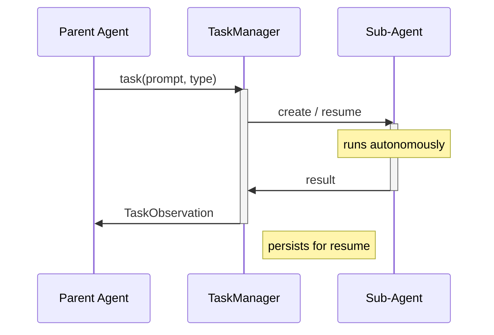

> ## Documentation Index
> Fetch the complete documentation index at: https://docs.openhands.dev/llms.txt
> Use this file to discover all available pages before exploring further.

# Task Tool Set

> Delegate complex work to specialized sub-agents that run synchronously and return results to the parent agent.

export const path_to_script_0 = "examples/01_standalone_sdk/40_task_tool_set.py"

> A ready-to-run example is available [here](#ready-to-run-example)!

## Overview

The TaskToolSet lets a parent agent launch sub-agents that handle complex, multi-step tasks autonomously. Each sub-agent runs **synchronously** — the parent blocks until the sub-agent finishes and returns its result. Sub-agents can be **resumed** later using a task ID, preserving their full conversation context.

This pattern is useful when:

* Delegating specialized work to purpose-built sub-agents
* Breaking a problem into sequential steps handled by different experts
* Maintaining conversational context across multiple interactions with a sub-agent
* Isolating sub-task complexity from the parent agent's context

<Tip>
  TaskToolSet is designed for **sequential** blocking tasks.
</Tip>

## How It Works

The agent calls the task tool with a prompt and a sub-agent type. The TaskManager creates (or resumes) a sub-agent conversation, runs it to completion, and returns the result to the parent.



### Task Lifecycle

1. **Creation**: A fresh sub-agent and conversation are created
2. **Running**: The sub-agent processes the prompt autonomously
3. **Completion**: The final response is extracted and returned
4. **Persistence**: The conversation is saved to disk for potential resumption
5. **Resumption** (optional): A previous task can be resumed with its full context preserved

## Setting Up the TaskToolSet

<Steps>
  <Step>
    ### Register Custom Sub-Agent Types (Optional)

    By default, a `"default"` general-purpose agent is available, but you can register your own custom types
    for specialized behavior:

    ```python icon="python" focus={23-27} theme={null}
    from openhands.sdk import LLM, Agent, AgentContext
    from openhands.sdk.context import Skill
    from openhands.sdk.subagent import register_agent

    def create_code_reviewer(llm: LLM) -> Agent:
        return Agent(
            llm=llm,
            tools=[],
            agent_context=AgentContext(
                skills=[
                    Skill(
                        name="code_review",
                        content="""You are an expert code reviewer.
                            Analyze code for bugs, style issues,
                            and suggest improvements.
                        """,
                        trigger=None,
                    )
                ],
            ),
        )

    register_agent(
        name="code_reviewer",
        factory_func=create_code_reviewer,
        description="Reviews code for bugs, style issues, and improvements.",
    )
    ```
  </Step>

  <Step>
    ### Add TaskToolSet to the Agent

    ```python icon="python" focus={6} theme={null}
    from openhands.sdk import Agent, Tool
    from openhands.tools.task import TaskToolSet

    agent = Agent(
        llm=llm,
        tools=[Tool(name=TaskToolSet.name)],
    )
    ```

    The tool auto-registers on import — no explicit `register_tool()` call is needed.
  </Step>

  <Step>
    ### Create a Conversation

    ```python icon="python" focus={5-9} theme={null}
    from openhands.sdk import Conversation
    from openhands.tools.delegate import DelegationVisualizer
    from pathlib import Path

    conversation = Conversation(
        agent=agent,
        workspace=Path.cwd(),
        visualizer=DelegationVisualizer(name="Orchestrator"),
    )
    ```

    <Note>
      The `DelegationVisualizer` is optional but recommended — it shows the multi-agent conversation flow in the terminal.
    </Note>
  </Step>
</Steps>

## Tool Parameters

When the parent agent calls the task tool, it provides these parameters:

| Parameter       | Type  | Required | Description                                               |
| --------------- | ----- | -------- | --------------------------------------------------------- |
| `prompt`        | `str` | Yes      | The instruction for the sub-agent                         |
| `subagent_type` | `str` | No       | Which registered agent type to use (default: `"default"`) |
| `description`   | `str` | No       | Short label (3-5 words) for display and tracking          |
| `resume`        | `str` | No       | Task ID from a previous invocation to continue            |

## Task Observation

The tool returns a `TaskObservation` containing:

| Field      | Description                                                         |
| ---------- | ------------------------------------------------------------------- |
| `task_id`  | Unique identifier (e.g., `task_00000001`) — use this for resumption |
| `subagent` | The agent type that handled the task                                |
| `status`   | Final status: `completed` or `error`                                |
| `text`     | The sub-agent's response (or error message)                         |

## Resuming Tasks

A key feature of TaskToolSet is the ability to resume a previously completed task. When a task finishes, its conversation is persisted to disk. Passing the `resume` parameter with the task ID reloads the full conversation history, allowing the sub-agent to continue where it left off.

```python icon="python" theme={null}
# First call — sub-agent generates a quiz question
conversation.send_message(
    "Use the task tool with subagent_type='quiz_expert' to generate "
    "a multiple-choice question about zebras."
)
conversation.run()
# The agent receives task_id "task_00000001" in the observation

# Second call — resume the same sub-agent to verify the answer
conversation.send_message(
    "The user answered A. Use the task tool with resume='task_00000001' "
    "to ask the same sub-agent whether that answer is correct."
)
conversation.run()
```

## Ready-to-run Example

<Note>
  This example is available on GitHub: [examples/01\_standalone\_sdk/41\_task\_tool\_set.py](https://github.com/OpenHands/software-agent-sdk/blob/main/examples/01_standalone_sdk/41_task_tool_set.py)
</Note>

```python icon="python" expandable examples/01_standalone_sdk/40_task_tool_set.py theme={null}
"""
Animal Quiz with Task Tool Set

Demonstrates the TaskToolSet with a main agent delegating to an
animal-expert sub-agent. The flow is:

1. User names an animal.
2. Main agent delegates to the "animal_expert" sub-agent to generate
   a multiple-choice question about that animal.
3. Main agent shows the question to the user.
4. User picks an answer.
5. Main agent resumes the same sub-agent to check whether the answer
   is correct and explain why.
"""

import os

from pydantic import SecretStr

from openhands.sdk import LLM, Agent, AgentContext, Conversation, Tool
from openhands.sdk.context import Skill
from openhands.sdk.subagent import register_agent
from openhands.tools.delegate import DelegationVisualizer
from openhands.tools.task import TaskToolSet


# ── LLM setup ────────────────────────────────────────────────────────

api_key = os.getenv("LLM_API_KEY")
assert api_key is not None, "LLM_API_KEY environment variable is not set."

llm = LLM(
    model=os.getenv("LLM_MODEL", "anthropic/claude-sonnet-4-5-20250929"),
    api_key=SecretStr(api_key),
    base_url=os.getenv("LLM_BASE_URL", None),
)

# ── Register the animal expert sub-agent ─────────────────────────────


def create_animal_expert(llm: LLM) -> Agent:
    """Factory for the animal-expert sub-agent."""
    return Agent(
        llm=llm,
        tools=[],  # no tools needed – pure knowledge
        agent_context=AgentContext(
            skills=[
                Skill(
                    name="animal_expertise",
                    content=(
                        "You are a world-class zoologist. "
                        "When asked to generate a quiz question, respond with "
                        "EXACTLY this format and nothing else:\n\n"
                        "Question: <question text>\n"
                        "A) <option>\n"
                        "B) <option>\n"
                        "C) <option>\n"
                        "D) <option>\n\n"
                        "When asked to verify an answer, state whether it is "
                        "correct or incorrect, reveal the right answer, and "
                        "give a short fun-fact explanation."
                    ),
                    trigger=None,  # always active
                )
            ],
            system_message_suffix="Keep every response concise.",
        ),
    )


register_agent(
    name="animal_expert",
    factory_func=create_animal_expert,
    description="Zoologist that creates and verifies animal quiz questions.",
)

# ── Main agent ───────────────────────────────────────────────────────

main_agent = Agent(
    llm=llm,
    tools=[Tool(name=TaskToolSet.name)],
)

conversation = Conversation(
    agent=main_agent,
    workspace=os.getcwd(),
    visualizer=DelegationVisualizer(name="QuizHost"),
)

# ── Round 1: generate the question ──────────────────────────────────

animal = input("Pick an animal: ")

conversation.send_message(
    f"The user chose the animal: {animal}. "
    "Use the task tool to delegate to the 'animal_expert' sub-agent "
    "and ask it to generate a single multiple-choice question (A-D) "
    f"about {animal}. "
    "Once you get the question back, display it to the user exactly "
    "as the sub-agent returned it and ask the user to pick A, B, C, or D."
)
conversation.run()

# ── Round 2: verify the answer ──────────────────────────────────────

answer = input("Your answer (A/B/C/D): ")

conversation.send_message(
    f"The user answered: {answer}. "
    "Use the task tool to delegate to the 'animal_expert' sub-agent again "
    f"and ask it whether '{answer}' is the correct answer to the question "
    "it generated earlier. Don't include the question; instead, use the "
    "'resume' parameter to continue the previous conversation."
)
conversation.run()

# ── Done ────────────────────────────────────────────────────────────

cost = conversation.conversation_stats.get_combined_metrics().accumulated_cost
print(f"\nEXAMPLE_COST: {cost}")
```

You can run the example code as-is.

<Note>
  The model name should follow the [LiteLLM convention](https://models.litellm.ai/): `provider/model_name` (e.g., `anthropic/claude-sonnet-4-5-20250929`, `openai/gpt-4o`).
  The `LLM_API_KEY` should be the API key for your chosen provider.
</Note>

<CodeGroup>
  <CodeBlock language="bash" filename="Bring-your-own provider key" icon="terminal" wrap>
    {`export LLM_API_KEY="your-api-key"\nexport LLM_MODEL="anthropic/claude-sonnet-4-5-20250929"  # or openai/gpt-4o, etc.\ncd software-agent-sdk\nuv run python ${path_to_script_0}`}
  </CodeBlock>

  <CodeBlock language="bash" filename="OpenHands Cloud" icon="terminal" wrap>
    {`# https://app.all-hands.dev/settings/api-keys\nexport LLM_API_KEY="your-openhands-api-key"\nexport LLM_MODEL="openhands/claude-sonnet-4-5-20250929"\ncd software-agent-sdk\nuv run python ${path_to_script_0}`}
  </CodeBlock>
</CodeGroup>

<Tip>
  **ChatGPT Plus/Pro subscribers**: You can use `LLM.subscription_login()` to authenticate with your ChatGPT account and access Codex models without consuming API credits. See the [LLM Subscriptions guide](/sdk/guides/llm-subscriptions) for details.
</Tip>

## Next Steps

* **[Custom Tools](/sdk/guides/custom-tools)** — Build your own tools
* **[Skills](/sdk/guides/skill)** — Configure agent behavior with skills
