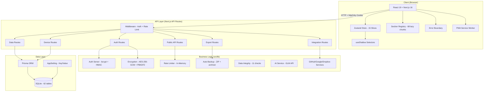
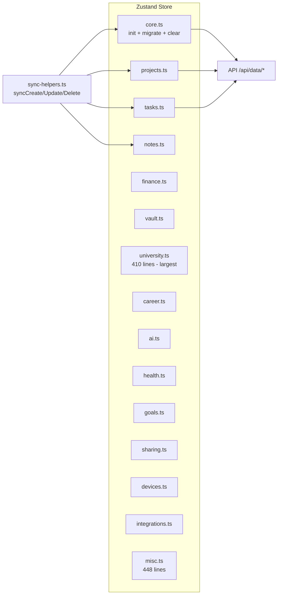
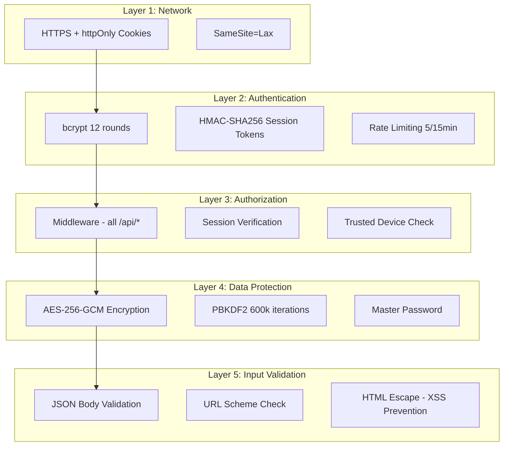
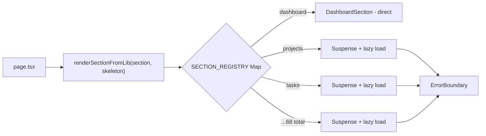
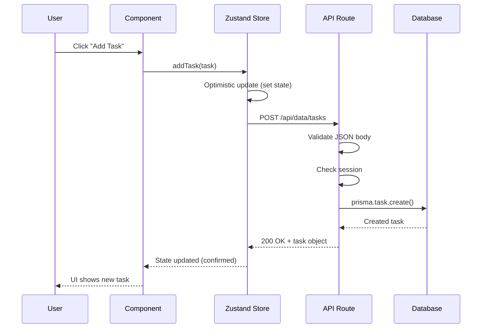

# 🏗️ Architecture Diagram — MiMo Life OS

## System Overview



## Store Architecture (15 Slices)



## Security Architecture



## Section Registry Pattern



## Data Flow



## Technology Stack

```
┌─────────────────────────────────────────────┐
│              Frontend                       │
├─────────────────────────────────────────────┤
│ Next.js 16 (App Router + Turbopack)         │
│ React 19 + TypeScript 5                     │
│ Tailwind CSS 4 + shadcn/ui (New York)      │
│ Framer Motion (animations)                  │
│ Recharts (charts)                           │
│ Zustand 5 (state - 15 slices)              │
│ Cairo font (Arabic RTL)                     │
├─────────────────────────────────────────────┤
│              Backend                        │
├─────────────────────────────────────────────┤
│ Next.js API Routes (55 routes)              │
│ Prisma 6 ORM + SQLite (WAL mode)           │
│ bcrypt + AES-256-GCM + PBKDF2 (600k)       │
│ HMAC-SHA256 sessions                        │
│ z-ai-web-dev-sdk (GLM AI)                   │
├─────────────────────────────────────────────┤
│              Infrastructure                 │
├─────────────────────────────────────────────┤
│ Bun (runtime + package manager)             │
│ PWA (manifest + service worker)             │
│ Web Push (VAPID)                            │
│ Startup Check + Watchdog (auto-restart)     │
└─────────────────────────────────────────────┘
```
